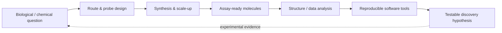

# Dr. Sameer Reddy Marri
### Ph.D., MRSC, CSci · Medicinal Chemistry · Scientific Software

---

## Hello, I’m Sameer 👋

I’m a **Postdoctoral Research Associate** at the [Boston University Center for Molecular Discovery](https://www.bu.edu/cmd/), working where synthetic chemistry, chemical biology, and scientific software meet. My research focuses on infectious-disease medicinal chemistry—including *Leishmania*, orthopoxvirus, and fungal Hsp90 programs—plus photoaffinity and fluorescent probe design for target identification.

I bring **8+ years** across hit-to-lead, multi-step synthesis, scale-up, and chemical biology: five years in pharmaceutical CRO discovery (Piramal, Sai Life Sciences) and current postdoctoral leadership at BU. Alongside the bench, I build open tools that chemists and computational scientists can actually run—document pipelines, chemical format converters, and agentic molecular visualization.

> **Research north star:** turn stalled chemistry and messy scientific data into molecules, insights, and software that move programs forward.

### What I’m exploring now

- Infectious-disease hit-to-lead and probe-enabled target ID
- Route design, protecting-group strategy, and multigram delivery under real program pressure
- Privacy-first scientific document → Markdown pipelines for LLM / RAG workflows
- Cheminformatics utilities (CDXML / SDF / CSV) and dual-mode desktop tools
- Agentic interfaces for structure visualization and PyMOL-centered discovery workflows

---

## Flagship open-source work

<table>
<tr>
<td width="50%" valign="top">

### 🧬 PyMolAI
**Agentic interface for PyMOL workflows**

AI assistant layer on open-source PyMOL—run molecular visualization, analysis, and figure workflows through natural language and tools scientists already trust.

</td>
<td width="50%" valign="top">

### 📄 MDfier
**Privacy-first document → Markdown**

100% offline desktop app that turns PDF, DOCX, PPTX, and images into clean, LLM-ready Markdown (and back). Layout-aware parsing, GFM tables, local RapidOCR—no APIs, no network leaks.

</td>
</tr>
<tr>
<td width="50%" valign="top">

### ⚗️ Convertia
**Chemical format conversion, done locally**

Standalone Windows utility for CDXML ↔ SDF ↔ CSV conversions. Dual-mode binary: GUI on double-click, high-performance CLI when you need throughput. Powered by RDKit and spatial proximity heuristics.

</td>
<td width="50%" valign="top">

### 🌐 Portfolio
**Research + software in one place**

Background, publications, and tools for infectious-disease medicinal chemistry and scientific software engineering.

</td>
</tr>
</table>

  <a href="https://github.com/sameer24688-jpg?tab=repositories"><strong>Explore all repositories →</strong></a>

---

## Bench-to-software pipeline

---

## Technical ecosystem

**Chemistry & discovery**

**Scientific computing & software**

---

## GitHub analytics

---

## Selected scholarship & impact

- **17 publications · 295+ citations** spanning medicinal chemistry, synthesis, and discovery science
- Postdoctoral leadership across **Leishmania, orthopoxvirus, and fungal Hsp90** programs at BU CMD
- Prior CRO discovery experience at **Sai Life Sciences** and **Piramal Discovery Solutions** (oncology, CNS, anti-infectives)
- **MRSC** and **Chartered Scientist (CSci)**; Ph.D. Chemistry, Central University of Gujarat
- Builder of practical open-source tools for chemists: document intelligence, format conversion, and molecular visualization AI

---

## Let’s build something consequential

I’m open to collaborations spanning:

- Infectious-disease medicinal chemistry and probe design
- Hit-to-lead / scale-up strategy for stalled synthetic routes
- Scientific software for chemists (cheminformatics, offline document tools, visualization agents)
- Bridging wet-lab discovery with reproducible computational workflows

<em>Better molecules move faster when the chemistry, evidence, and tools are open.</em>

