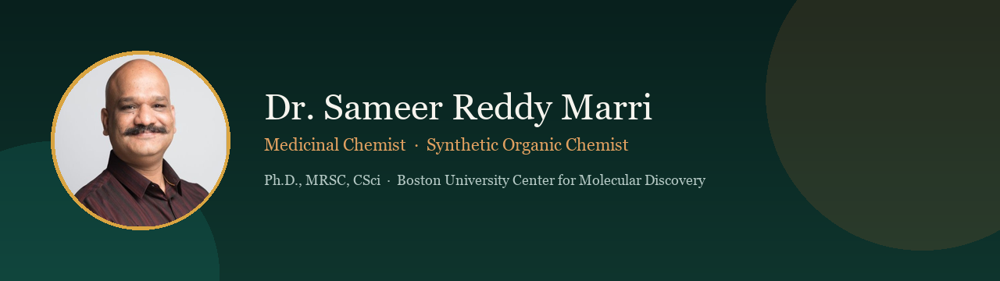
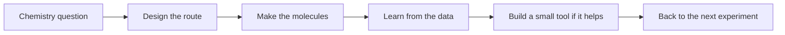

---

## Hello, I’m Sameer 👋

I’m a **medicinal and synthetic organic chemist** — currently a Postdoctoral Research Associate at the [Boston University Center for Molecular Discovery](https://www.bu.edu/cmd/).

I’ve spent **8+ years** at the bench: hit-to-lead work, multi-step synthesis, scale-up, and chemical biology. Five of those years were in pharmaceutical CRO discovery, where I learned to design routes, keep campaigns moving, and fix chemistry when it stalls.

I’m also an **AI enthusiast**. Outside the lab, I’ve been teaching myself AI-assisted programming and using it to build small tools that make chemists’ day-to-day work easier — things like document cleanup, chemical format conversion, and molecular visualization helpers.

> I care about chemistry that ships — and tools that save someone an afternoon.

### What I’m into right now

- Medicinal and synthetic organic chemistry in discovery settings
- Route design, protecting-group strategy, and getting molecules to scale
- Learning by building: AI-assisted coding for practical lab-adjacent tools
- Offline document → Markdown pipelines for reading papers with LLMs
- Simple cheminformatics utilities and PyMOL-centered workflows

**Focus:** Hit-to-Lead · Multi-step Synthesis · Route Scouting · Scale-up · Chemical Biology · AI-Assisted Programming

---

## Things I’ve been building

<table>
<tr>
<td width="50%" valign="top">

### 🧬 [PyMolAI](https://github.com/sameer24688-jpg/PyMolAI)
**Chat with PyMOL**

An AI layer on open-source PyMOL so you can drive visualization and analysis in plain language, without fighting the command line every time.

</td>
<td width="50%" valign="top">

### 📄 [MDfier](https://github.com/sameer24688-jpg/MDfier)
**Papers → clean Markdown, offline**

A desktop app that turns PDFs, Word docs, decks, and images into LLM-ready Markdown — locally, with no cloud upload. Handy when you want RAG-friendly text without sending files anywhere.

</td>
</tr>
<tr>
<td width="50%" valign="top">

### ⚗️ [Convertia](https://github.com/sameer24688-jpg/Convertia)
**CDXML / SDF / CSV without the headache**

A small Windows utility (GUI or CLI) for converting common chemical formats. Built with RDKit for days when ChemDraw and spreadsheets don’t want to talk to each other.

</td>
<td width="50%" valign="top">

### 🌐 [Research portfolio](https://github.com/sameer24688-jpg/SameerReddyM.github.io)
**A bit more about the path**

Background, publications, and how I got from organic chemistry benches in Hyderabad to discovery chemistry at Boston University.

</td>
</tr>
</table>

  <a href="https://github.com/sameer24688-jpg?tab=repositories"><strong>See all repositories →</strong></a>

---

## How I like to work

---

## Toolkit

**Chemistry**

**Coding (still learning, building in public)**

---

## GitHub analytics

---

## A quick look at the journey

| Role | Org | Notes |
|---|---|---|
| Postdoctoral Research Associate (2023–Present) | Boston University CMD | Discovery synthesis and scale-up in infectious-disease medicinal chemistry |
| Research Scientist — Discovery & Scale-Up (2020–2023) | Sai Life Sciences | Long routes, mg→multigram delivery; Outstanding Contributor Award (2021) |
| Research Scientist — Discovery Chemistry (2018–2020) | Piramal Discovery Solutions | Oncology, CNS, and anti-infective programs; route optimization |

**Education:** Ph.D. Chemistry (CUG) · M.Phil. Chemistry (CUG) · M.Sc. Organic Chemistry (Osmania) · B.Sc. (Osmania)

---

## A few things I’m proud of

- **17 publications · 295+ citations** in medicinal chemistry and synthesis
- Discovery and scale-up experience across CRO and academic settings
- Time at **Sai Life Sciences** and **Piramal Discovery Solutions** before BU
- **MRSC** and **Chartered Scientist (CSci)**, Science Council UK
- Peer reviewing for journals, plus a couple of Schrödinger certifications
- Teaching myself to ship useful chemist tools with AI-assisted programming

---

## Happy to connect

Always glad to talk about:

- Medicinal / synthetic / process chemistry opportunities
- Hit-to-lead and scale-up problems that need a stubborn chemist
- Building small, useful tools for chemists with AI-assisted coding
- Mixing wet-lab work with practical computation

<em>Good chemistry, honest tools, and a little curiosity go a long way.</em>

